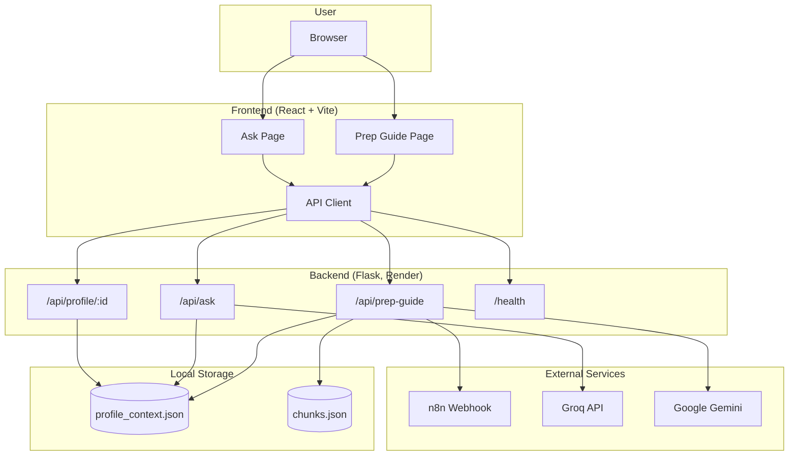
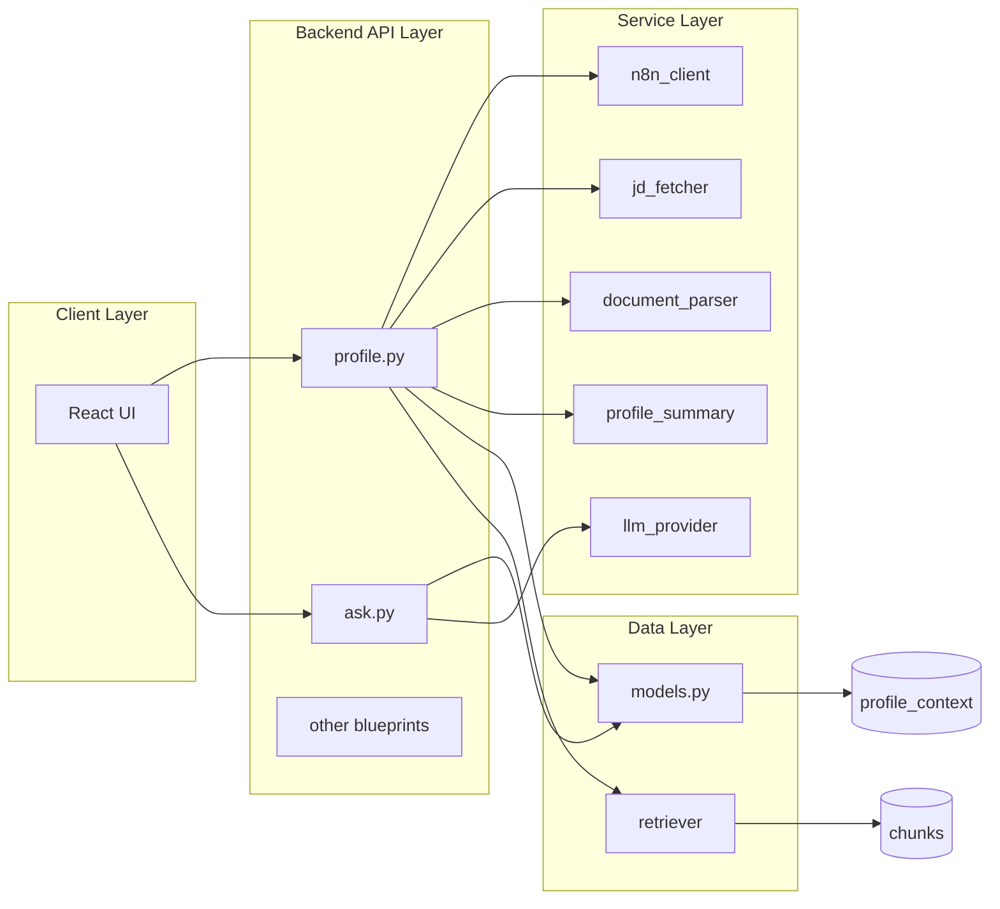
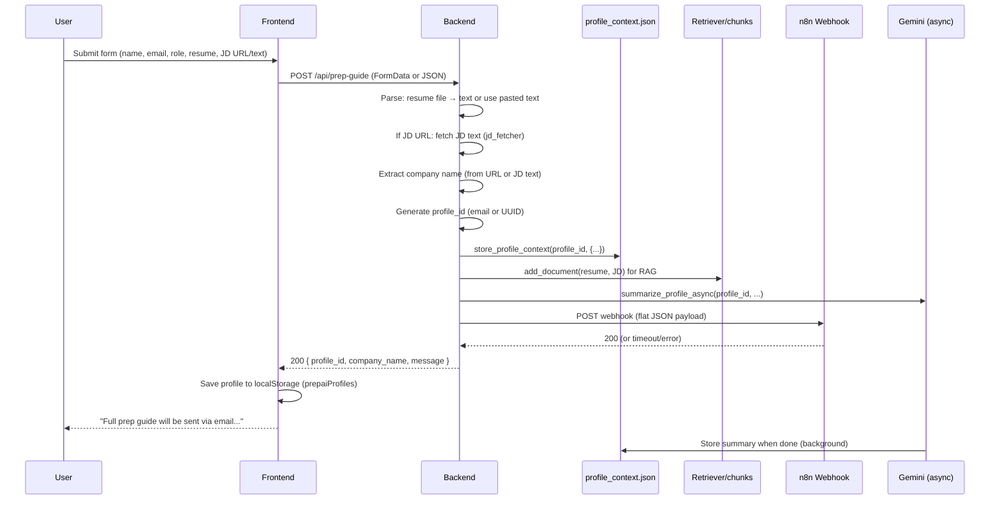
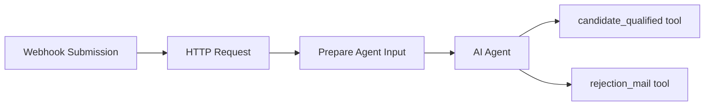
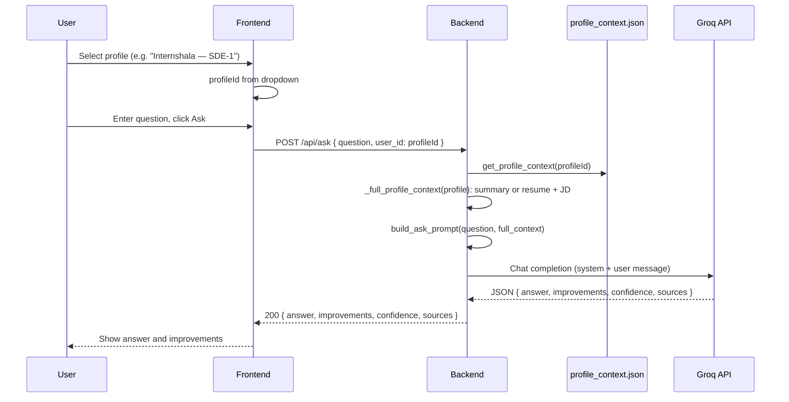
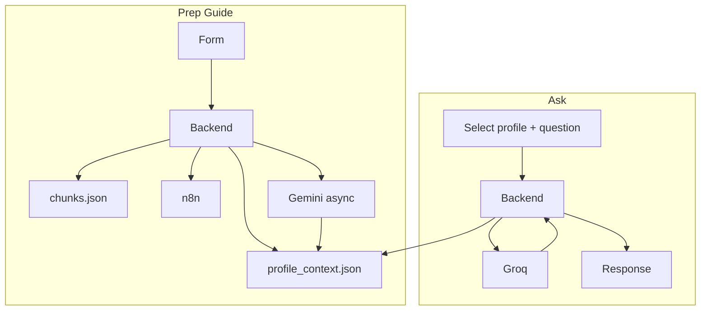

# PrepAI — End-to-End Architecture

This document describes the full system architecture: backend API, frontend, n8n workflows, data storage, and Render deployment.

---

## 1. System Overview

PrepAI is an interview preparation app with two main flows:

1. **Prep Guide** — User submits profile (name, email, role, resume, JD); backend stores it, triggers n8n to qualify and email a prep guide; profile is available for Q&A.
2. **Ask** — User selects a saved profile and asks interview questions; answers are personalized using full resume + JD context via Groq (or configured LLM).

---

## 2. High-Level Architecture Diagram



---

## 3. Component Diagram



---

## 4. Prep Guide Flow (End-to-End)

### 4.1 Sequence Diagram



### 4.2 Backend: Prep Guide API

| Aspect | Detail |
|--------|--------|
| **Endpoints** | `POST /api/profile/init`, `POST /api/prep-guide` (same handler) |
| **Input** | `name`, `email`, `role`, `resume_text` or `resume_file` (txt/pdf/docx), `jd_url` or `jd_text`, `additional_notes` |
| **Resume** | If file uploaded → `document_parser.extract_text_from_upload()`; else use `resume_text`. File takes precedence if both provided. |
| **JD** | If `jd_url` → `jd_fetcher.fetch_job_description(url)`; else use `jd_text`. |
| **Company name** | From `jd_fetcher.extract_company_name_from_url(jd_url)` or `extract_company_name_from_jd_text(jd_text)`. |
| **Storage** | `models.store_profile_context(profile_id, {...})` → `data/profile_context.json`. |
| **RAG** | `retriever.add_document()` for resume and JD → `data/chunks.json`. |
| **Async** | `profile_summary.summarize_profile_async()` (Gemini) updates profile with `summary_context` when done. |
| **n8n** | `n8n_client.post_webhook(N8N_PREPAI_WEBHOOK_URL, payload)` with **flat JSON** (see below). |

### 4.3 n8n Webhook Payload (Flat JSON)

Backend sends a **flat** JSON body (no `body` wrapper). n8n must read top-level keys:

```json
{
  "Your name": "Jane Doe",
  "Email": "jane@example.com",
  "Role you're applying for": "ML Engineer",
  "Resume text": "...",
  "Job description URL": "https://...",
  "Or paste job description text": "",
  "Additional notes": "..."
}
```

- If user provides only JD URL → `Job description URL` set, `Or paste job description text` empty.
- If user only pastes JD text → `Job description URL` empty, `Or paste job description text` set.

---

## 5. n8n Workflow Architecture

### 5.1 Workflow 1: Interview Prep Assistant (Form Submission)

**Trigger:** Webhook `POST /webhook/interview-prep` (path: `interview-prep`).

**Flow:**



| Node | Purpose |
|------|--------|
| **Webhook Submission** | Receives flat JSON from backend. |
| **HTTP Request** | Optional: calls external API (e.g. Relevance) with JD URL to enrich job description. |
| **Prepare Agent Input** | Maps webhook + HTTP response into structured fields for the agent. |
| **AI Agent** | Decides if candidate is qualified; has access to tools. |
| **candidate_qualified** | Tool: triggers sub-workflow "Interview Guide Classifier and Notifier" (sends prep guide email). |
| **rejection_mail** | Tool: sends "not the right fit" email via Gmail. |

**Credentials (in n8n):** OpenAI (for agent), Gmail OAuth2 (for emails).

### 5.2 Workflow 2: Interview Guide Classifier and Notifier

Invoked by the **candidate_qualified** tool from Workflow 1. Consumes:

- Name, Email, Role, Job Description, Resume, Additional Notes, Qualified.

Flow: classify seniority (e.g. fresher / mid_level / senior) → generate role-specific prep guide (OpenAI) → send personalized email via Gmail.

---

## 6. Ask Flow (End-to-End)

### 6.1 Sequence Diagram



### 6.2 Backend: Ask API

| Aspect | Detail |
|--------|--------|
| **Endpoint** | `POST /api/ask` |
| **Input** | `question`, `user_id` (profile_id), optional `context` override. |
| **Provider** | Prefers **Groq** if `GROQ_API_KEY` is set (`get_ask_provider()`); else default LLM. |
| **Context** | Full profile context every time: `_full_profile_context(profile)` → summary if present, else resume (≈6k chars) + JD (≈4k chars). No RAG for Ask. |
| **Output** | `answer`, `improvements[]`, `confidence`, `sources[]`. |

---

## 7. Backend Service Structure

### 7.1 API Blueprints (Flask)

| Blueprint | File | Routes | Role |
|-----------|------|--------|------|
| profile | `api/profile.py` | `POST /api/prep-guide`, `POST /api/profile/init`, `GET /api/profile/<id>` | Prep Guide + profile CRUD |
| ask | `api/ask.py` | `POST /api/ask` | Interview Q&A (Groq + full context) |
| evaluate | `api/evaluate.py` | `POST /api/evaluate` | Score candidate answer |
| prepare | `api/prepare.py` | `POST /api/prepare` | Roadmap from resume + JD |
| upload | `api/upload.py` | `POST /api/upload` | Text/file upload, RAG index |
| feedback | `api/feedback.py` | `POST /api/feedback` | Store feedback |
| webhook | `api/webhook.py` | `POST /api/webhook` | Generic n8n-style webhook |
| fetch_jd | `api/fetch_jd.py` | `POST /api/fetch-jd` | Fetch JD from URL |
| n8n_submit | `api/n8n_submit.py` | `POST /api/n8n/submit` | Proxy to n8n |

Root: `GET /`, `GET /health`.

### 7.2 Services

| Service | Role |
|---------|------|
| `llm_provider` | Provider abstraction: mock, OpenAI, Anthropic, Gemini, **Groq**. Ask uses `get_ask_provider()` (Groq if key set). |
| `n8n_client` | `post_webhook(url, payload)` for Prep Guide. |
| `jd_fetcher` | Fetch JD from URL; extract company name from URL or JD text. |
| `document_parser` | Extract text from PDF/DOCX/TXT uploads. |
| `profile_summary` | Async Gemini summary of resume + JD → stored in profile. |
| `retriever` | RAG: TF-IDF over `data/chunks.json` (used for indexing; Ask uses full context, not RAG). |
| `prompt_templates` | Build prompts for ask, evaluate, prepare. |
| `security` | PII redaction for logs. |

### 7.3 Data (models.py)

- **profile_context.json** — Keyed by `profile_id`. Each value: profile fields, `summary_status`, `summary_context` (from Gemini), `company_name`, timestamps.
- **feedback.json** — Append-only feedback entries.
- **chunks.json** — RAG chunks (resume/JD per profile).

---

## 8. Frontend Structure

- **Stack:** React, Vite, React Router, Tailwind.
- **Routes:** `/` → Prep Guide; `/ask` → Ask.
- **Prep Guide:** Form (name, email, role, resume file or text, JD URL or text, notes) → `initProfileFlow()` → `POST /api/prep-guide`. On success, appends `{ id, companyName, role }` to `localStorage.prepaiProfiles` and sets `prepaiProfileId`.
- **Ask:** Reads `prepaiProfiles` from localStorage; dropdown to select profile; `GET /api/profile/:id` for status; `POST /api/ask` with `user_id: profileId` and question. Displays answer, improvements, confidence.

---

## 9. Render Deployment

### 9.1 Configuration (render.yaml)

```yaml
services:
  - type: web
    name: prepai-backend
    runtime: python
    rootDir: backend
    buildCommand: pip install -r requirements.txt
    startCommand: gunicorn app:app --bind 0.0.0.0:$PORT
    envVars:
      - key: LLM_PROVIDER
        value: auto
      - key: PYTHON_VERSION
        value: 3.11.0
```

### 9.2 Environment Variables (Render Dashboard)

| Variable | Purpose |
|----------|---------|
| `GROQ_API_KEY` | Used by `/api/ask` (Groq provider). |
| `GOOGLE_API_KEY` | Optional: background profile summary (Gemini). |
| `N8N_PREPAI_WEBHOOK_URL` | Full n8n webhook URL (e.g. `https://prepai.app.n8n.cloud/webhook/interview-prep`). |
| `LLM_PROVIDER` | `auto` or `groq` / `gemini` / etc. |
| `PYTHON_VERSION` | e.g. `3.11.0`. |

### 9.3 Deploy Flow

1. Push to GitHub (e.g. `main`).
2. Render detects repo; if using Blueprint, uses `render.yaml`.
3. Build: `pip install -r requirements.txt` in `backend`.
4. Start: `gunicorn app:app --bind 0.0.0.0:$PORT`.
5. Frontend must point to Render backend URL via `VITE_API_BASE_URL` at build time.

---

## 10. Data Flow Summary



---

## 11. Project Structure (Relevant Paths)

```
PrepAI/
├── ARCHITECTURE.md       # This document
├── README.md
├── render.yaml           # Render backend config
├── backend/
│   ├── app.py            # Flask app, blueprints, /health
│   ├── models.py         # profile_context, feedback persistence
│   ├── api/
│   │   ├── profile.py    # /api/prep-guide, /api/profile/:id
│   │   └── ask.py        # /api/ask (Groq + full context)
│   ├── services/
│   │   ├── llm_provider.py   # Groq, Gemini, OpenAI, etc.
│   │   ├── n8n_client.py
│   │   ├── jd_fetcher.py
│   │   ├── document_parser.py
│   │   └── profile_summary.py
│   ├── requirements.txt
│   ├── Procfile
│   └── .env.example
├── frontend/
│   ├── src/
│   │   ├── App.jsx
│   │   ├── api.js
│   │   └── pages/
│   │       ├── Prep.jsx
│   │       └── Ask.jsx
│   └── package.json
├── n8n/
│   ├── Interview Prep Assistant (Form Submission).json
│   ├── Interview Guide Classifier and Notifier.json
│   └── README.md
└── data/                 # Runtime (gitignored in practice)
    ├── profile_context.json
    └── chunks.json
```

---

## 12. Quick Reference

| What | Where |
|------|--------|
| Prep Guide submit | Frontend → `POST /api/prep-guide` → backend stores profile, calls n8n, starts Gemini summary |
| n8n payload | Flat JSON: `Your name`, `Email`, `Role you're applying for`, `Resume text`, `Job description URL`, `Or paste job description text`, `Additional notes` |
| Ask | Frontend → `POST /api/ask` with `user_id` = selected profile id → backend loads profile, builds full context, calls Groq |
| Profile storage | `data/profile_context.json` keyed by profile_id |
| Deploy backend | Render: rootDir `backend`, gunicorn; set `GROQ_API_KEY`, `N8N_PREPAI_WEBHOOK_URL` |

For local run and env setup, see **README.md**.
