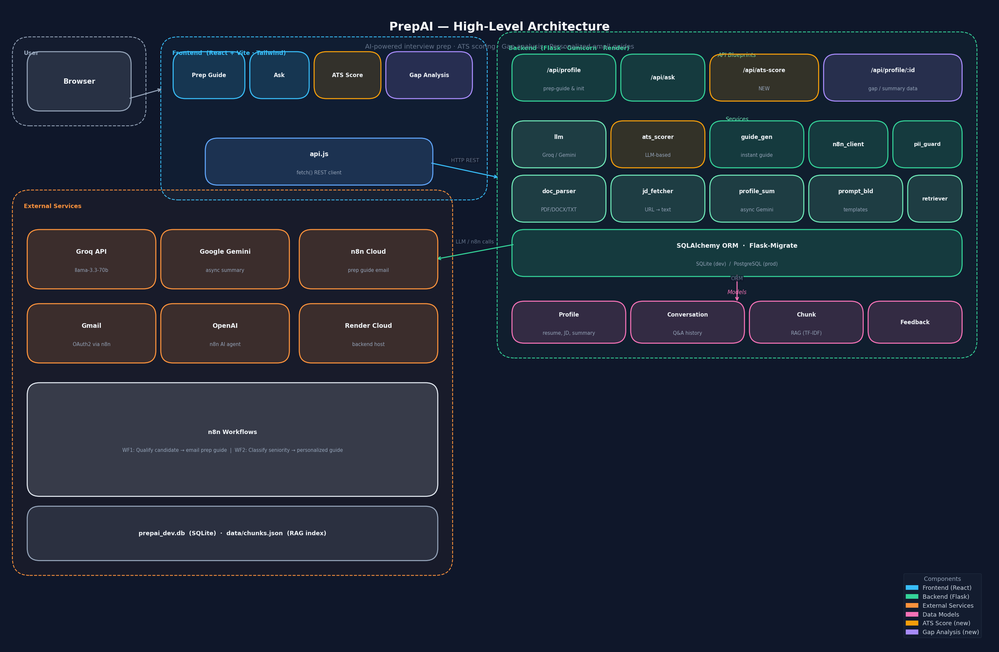

# PrepAI

> AI-powered interview preparation platform — personalized prep guides, smart Q&A, ATS scoring, and gap analysis.

[](https://python.org)
[](https://flask.palletsprojects.com)
[](https://react.dev)
[](https://vitejs.dev)
[](https://groq.com)
[](https://n8n.io)
[](https://render.com)
[](LICENSE)

---

## What is PrepAI?

PrepAI takes your resume and a job description, then gives you everything you need to ace the interview:

| Feature | Description |
|---------|-------------|
| **Prep Guide** | Submit your profile; qualified candidates receive a personalised prep guide by email (n8n + OpenAI + Gmail) |
| **Ask** | Chat with an AI that has full context of your resume and the JD — get interview-ready answers via Groq |
| **ATS Score** | See your ATS compatibility score (0–100), matched/missing keywords, category breakdown, and actionable suggestions |
| **Gap Analysis** | Surface your strengths, skill gaps, and prioritised focus areas from an AI analysis of your resume vs the role |

---

## Architecture

### High-Level Diagram



### Sequence Diagram


---

## Tech Stack

### Backend
| Layer | Technology |
|-------|-----------|
| Framework | Flask 3, Gunicorn |
| ORM | SQLAlchemy + Flask-Migrate |
| LLM — Q&A | Groq API (`llama-3.3-70b-versatile`) |
| LLM — Summary / Gaps | Google Gemini (async background) |
| LLM — ATS | Groq structured JSON call |
| Automation | n8n Cloud (prep guide email workflows) |
| Document parsing | PyMuPDF (PDF), python-docx (DOCX), plaintext |
| Retrieval (RAG) | TF-IDF (`scikit-learn`) over `chunks.json` |
| Database | SQLite (dev) / PostgreSQL (prod) |
| Deployment | Render (Blueprint via `render.yaml`) |

### Frontend
| Layer | Technology |
|-------|-----------|
| Framework | React 18 + Vite 5 |
| Styling | Tailwind CSS |
| Router | React Router v6 |
| State | React hooks + `localStorage` (profile list) |

---

## Features In Depth

### Prep Guide
- Upload resume (PDF / DOCX / TXT) or paste text
- Provide a JD URL or paste the JD directly
- Backend stores your profile, triggers n8n, and starts an async Gemini summary
- Qualified candidates get a seniority-aware prep guide with a 7-day study plan by email
- Profile is persisted and available for all other features immediately

### Ask
- Select any saved profile from the dropdown
- Ask any interview question — technical, behavioural, system design
- Answer uses your full resume + JD context (summary if ready, else raw text)
- Response includes `answer`, `improvements[]`, `confidence`, and `sources[]`

### ATS Score
- LLM-based analysis — not just keyword counting
- Returns an overall score (0–100) + category breakdown (skills / experience / education / keywords)
- Lists matched keywords (green) and missing keywords (red)
- Provides 3–5 specific, actionable resume improvements for the target role
- Works with stored profiles or ad-hoc resume + JD text

### Gap Analysis *(new)*
- Powered by the async Gemini summary run at profile creation time
- Surfaces **fit highlights** (your strengths), **likely gaps**, and **focus areas** for prep
- Shows resume highlights and role expectations side-by-side
- Status indicator — updates live as the background summary completes

---

## Project Structure

```
PrepAI/
├── backend/
│   ├── app.py                  # Flask app factory
│   ├── config.py               # All env vars and constants
│   ├── wsgi.py                 # Gunicorn entry point
│   ├── api/
│   │   ├── profile.py          # POST /api/prep-guide, /api/profile/init, GET /api/profile/:id
│   │   ├── ask.py              # POST /api/ask (Groq + full context)
│   │   ├── ats.py              # POST /api/ats-score  ← new
│   │   └── webhook.py          # POST /api/webhook
│   ├── services/
│   │   ├── llm/                # Groq / Gemini / OpenAI provider abstraction
│   │   ├── ats_scorer.py       # LLM-based ATS analysis  ← new
│   │   ├── guide_generator.py  # Instant guide (seniority classify + Markdown)
│   │   ├── jd_fetcher.py       # Fetch JD from URL; extract company name
│   │   ├── document_parser.py  # PDF / DOCX / TXT → text
│   │   ├── n8n_client.py       # POST flat JSON to n8n webhook
│   │   ├── profile_summary.py  # Async Gemini summary → DB
│   │   ├── prompt_builder.py   # Build ask / evaluate / prepare prompts
│   │   ├── pii_guard.py        # Redact PII before LLM calls
│   │   └── retriever.py        # TF-IDF RAG over chunks.json
│   ├── models/
│   │   ├── profile.py          # Profile SQLAlchemy model
│   │   ├── conversation.py     # Conversation model
│   │   ├── chunk.py            # Chunk model (RAG)
│   │   └── db.py               # db = SQLAlchemy()
│   ├── repositories/
│   │   ├── profile_repo.py
│   │   └── conversation_repo.py
│   ├── requirements.txt
│   ├── Procfile
│   └── .env.example
├── frontend/
│   ├── src/
│   │   ├── App.jsx             # Router, nav (Prep / Ask / ATS Score / Gap Analysis)
│   │   ├── api.js              # All API calls (health, ask, initProfileFlow, getAtsScore, …)
│   │   ├── components/
│   │   │   └── Header.jsx      # Health status indicator
│   │   └── pages/
│   │       ├── Prep.jsx        # Prep Guide form
│   │       ├── Ask.jsx         # Q&A with profile context
│   │       ├── AtsScore.jsx    # Score ring + category bars + keyword chips  ← new
│   │       └── GapAnalysis.jsx # Strengths / gaps / focus areas  ← new
│   ├── package.json
│   └── vite.config.js
├── n8n/
│   ├── Interview Prep Assistant (Form Submission).json
│   ├── Interview Guide Classifier and Notifier.json
│   └── README.md
├── data/                       # Runtime files (gitignored in prod)
│   └── chunks.json
├── HLD.png
├── Sequence Diagram.png
├── render.yaml
└── run-local.ps1
```

---

## Quick Start

### Prerequisites
- Python 3.11+
- Node.js 18+
- A [Groq API key](https://console.groq.com) (free tier works)

### Backend

```bash
cd backend
python -m venv venv
source venv/bin/activate          # Windows: venv\Scripts\activate
pip install -r requirements.txt

cp .env.example .env
# Edit .env — minimum required:
#   GROQ_API_KEY=gsk_...
#   N8N_PREPAI_WEBHOOK_URL=https://...  (optional — needed for email flow)
#   GOOGLE_API_KEY=...                  (optional — needed for Gemini summary)

flask db upgrade                   # or: python app.py (auto-creates tables)
python app.py
```

Backend runs at **http://localhost:5000**

### Frontend

```bash
cd frontend
npm install
echo "VITE_API_BASE_URL=http://localhost:5000" > .env
npm run dev
```

Frontend runs at **http://localhost:5173**

---

## Environment Variables

| Variable | Required | Purpose |
|----------|----------|---------|
| `GROQ_API_KEY` | Yes | Powers `/api/ask` and `/api/ats-score` (Groq llama-3.3-70b) |
| `GOOGLE_API_KEY` | No | Async Gemini summary + gap extraction |
| `N8N_PREPAI_WEBHOOK_URL` | No | Triggers email prep guide workflow |
| `DATABASE_URL` | No | `sqlite:///prepai_dev.db` by default; set to PostgreSQL in prod |
| `LLM_PROVIDER` | No | `auto` (default) — auto-detects from available keys |
| `CORS_ORIGINS` | No | Comma-separated allowed origins |
| `SECRET_KEY` | No | Flask secret key (change in production) |

---

## API Reference

| Method | Endpoint | Description |
|--------|----------|-------------|
| `POST` | `/api/profile/init` | Submit profile (resume + JD → store, n8n, Gemini) |
| `GET` | `/api/profile/:id` | Fetch stored profile (used by Ask and Gap Analysis) |
| `POST` | `/api/ask` | Ask an interview question with full profile context |
| `POST` | `/api/ats-score` | Compute ATS compatibility score |
| `GET` | `/health` | Health check (provider, model, status) |

### ATS Score — Request / Response

```json
// Request
{ "profile_id": "profile-abc123" }
// or ad-hoc:
{ "resume_text": "...", "jd_text": "..." }

// Response
{
  "score": 78,
  "matched_keywords": ["Python", "FastAPI", "Docker"],
  "missing_keywords": ["Kubernetes", "Terraform"],
  "category_scores": { "skills": 82, "experience": 75, "education": 90, "keywords": 70 },
  "suggestions": ["Add a Kubernetes section...", "Quantify your ML impact..."],
  "summary": "Strong Python and ML background..."
}
```

---

## n8n Workflows

Two workflows live in `n8n/`:

**Workflow 1 — Interview Prep Assistant (Form Submission)**
- Triggered by backend webhook after profile creation
- AI agent qualifies the candidate
- Calls `candidate_qualified` tool (sends detailed prep guide) or `rejection_mail` tool

**Workflow 2 — Interview Guide Classifier and Notifier**
- Invoked by Workflow 1 when candidate is qualified
- Classifies seniority (fresher / mid_level / senior)
- Generates personalised prep guide via OpenAI → sends via Gmail

Both workflows use flat JSON — see `/api/profile/init` for the exact payload schema.

---

## Deployment (Render)

```yaml
# render.yaml (excerpt)
services:
  - type: web
    name: prepai-backend
    runtime: python
    rootDir: backend
    buildCommand: pip install -r requirements.txt
    startCommand: gunicorn wsgi:app --bind 0.0.0.0:$PORT
```

Set `GROQ_API_KEY`, `N8N_PREPAI_WEBHOOK_URL`, and `DATABASE_URL` in the Render dashboard. The frontend is deployed separately (Netlify / Vercel) with `VITE_API_BASE_URL` pointing to the Render backend URL.

---

## Roadmap

- [x] Prep Guide with n8n email workflow
- [x] AI Q&A with full profile context (Groq)
- [x] ATS Score — LLM keyword + category analysis
- [x] Gap Analysis — strengths, gaps, focus areas
- [x] SQLAlchemy ORM + Flask-Migrate
- [ ] Celery + Redis for async task queue
- [ ] Conversation history persistence
- [ ] Mock interview mode (multi-turn)
- [ ] Resume rewrite suggestions

---

## License

MIT © [Abhisri](https://github.com/abhisri15)
